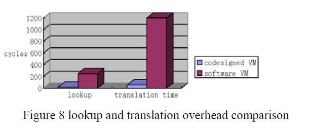
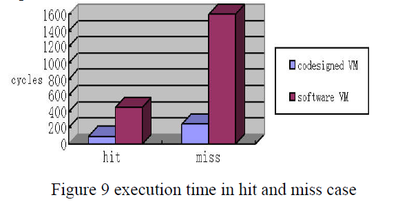
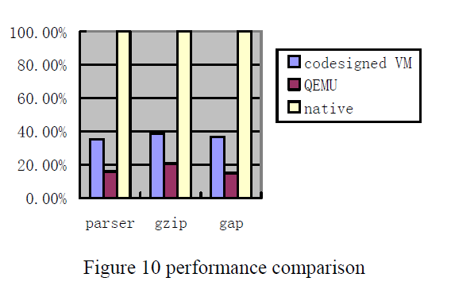
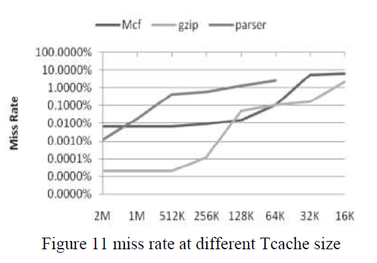

本文主要设计了加速核，通过加速核，对二进制翻译进行加速。
加速核独立于CPU，通过其Tcache以及翻译模块，加速整体效率。

<!-- more -->

## 简介

### 研究的问题

通过加速核，对二进制翻译进行加速。
加速核独立于CPU，通过其Tcache以及翻译模块，加速整体效率。

- 提高查找下一个基本块的速度
- 不需要上下文切换，提高cache利用，减少启动时间

### 结论

虚拟机性能几乎达到了本机性能的40%

## 开销分析

$$ T\_total = (1-F\_linked) * (T\_lookup + T\_context\_switch) + T\_execution + F\_cache\_miss\_rate * T\_translation $$

1. 没有链接情况下，下个TB寻找
1. 上下文切换开销
1. 翻译开销

## 解决办法

### 硬件来实现Tcache(Target code cache)管理器

Tcache管理器维护一个SPC-TPC(source PC, target PC)映射表，类似于TLB实现虚拟地址到物理地址的映射。

- 通过分支预测翻译单元可以提高块的链接率
- 采样出热点块让软件优化
- （实际上）还加快了查找下一个基本块的速度

### 硬件翻译模块

优势：

- 由于硬件翻译，不需要上下文切换（翻译进程和执行的切换）
- 实际上的cache命中提高（不用上下文切换，cache刷新少），减少启动时间
- 如果硬件转换单元在处理器执行相应指令之前转换基本块，则可以显著降低Tcache的失效率 <?

实现：

1. 维护`SPC`、`TPC`以及`hit_miss_reg`用于`native code`运行切换
1. 在没有被链接时，写`SPC`以及`hit_miss_reg`，让DBT启动翻译
1. `loop hit_miss_reg`，直到翻译完成
1. DBT会修改`hit_miss_reg`以及`TPC`
1. `jmp TPC`，执行下一个block

## 结果

- 对于`lookup and translation`，
  大约20个周期就可以完成查找操作，而转换一个基本块只需要不到60个周期。有10-25倍的加速。
- 对于`execution time in hit and miss case`，
  性能在命中和非命中之间没有明显的波动，这一特性对软件的实时性和启动性能至关重要。
- 协同设计的虚拟机性能几乎达到了本机性能的40%
- Tcache大小足够大，SPEC 2000程序的失效率就会非常低。

另外，由于协处理器的转换单元大部分时间是空闲的

- 为多处理器提供服务的能力，因为虚拟机协处理器的低缺失率
- 不需要的时候可以关闭翻译单元，以减少功耗

|                  `lookup and translation`                   |    `execution time in hit and miss case`    |
| :---------------------------------------------------------: | :-----------------------------------------: |
|  |  |

|                           整体性能                           |        Tcache大小和失效率         |
| :----------------------------------------------------------: | :-------------------------------: |
|  |  |
