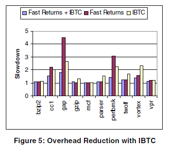

该论文主要研究简介跳转的优化问题。
使用IBTC(Indirect branch translation cache)技术。

<!-- more -->

## 简介

### 间接跳转的统计

由于简介跳转只有在运行时才能确定目标，所以没法被link。

主要有两类简介跳转：
- call return
- other indirect branch (主要是switch)

## IBTC

缓存简介跳转的位置，不再需要上下文切换。

1. 如果命中（目标寄存器数值与IBTC的`tag`一致），则直接跳转到IBTC记录地址
2. 如果不命中，执行上下文切换，并替换`target cache`中的数据

**一般IBTC表项为256时命中率就维持稳定了**

## fast return

由于IBTC寻找表项等还需要耗时，所以对于更多的call-ret，使用fast return优化

直接替换返回指令，使用code cache对应的地址，当返回执行时，它会跳转到片段缓存中的适当位置

**存在问题**

- 可能存在执行返回之前修改返回地址，导致错误
- 但这个违反了ABI，但这个是编译器和汇编语言程序员所避免的

## 性能分析

## 静态开销优化

通过追踪热点块，让他持久在cache中

- 可以离线收集热点块，然后读取。**缺陷：**脱机跟踪可能与程序的实际行为不匹配，特别是当输入数据对程序的执行有很大影响时

- NHE(next heaviest edge) （还不清楚咋做的）

  NHE通过从权重最大的种子边缘开始形成轨迹，并将与此边缘关联的块添加到轨迹中。 NHE通过选择权重最大的后继边缘和前任边缘，直到遇到跟踪条件结束，将新块添加到跟踪中。 跟踪条件的末尾考虑了后继边缘和先前边缘的重要性，代码重复以及跟踪的大小。